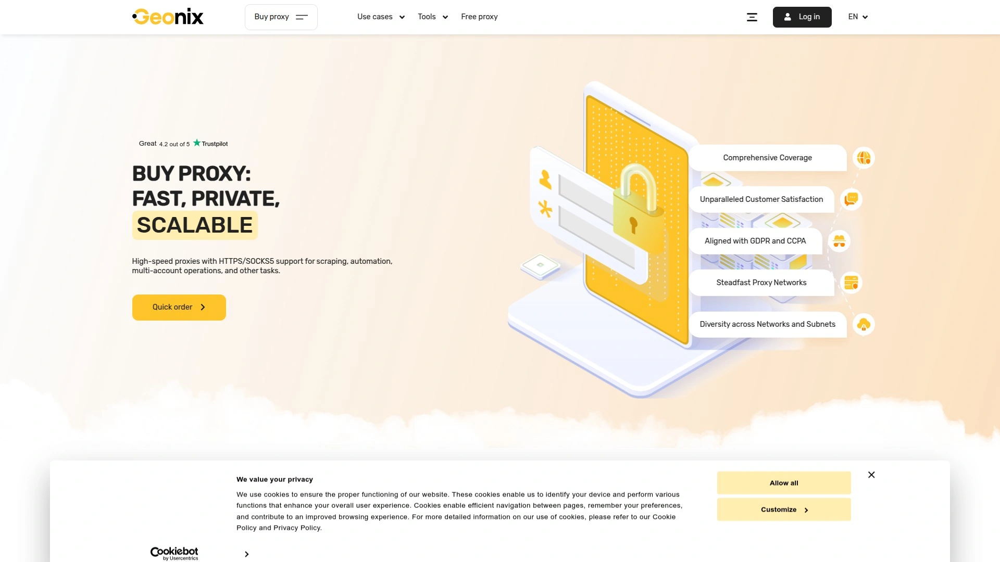

# Top 10 Anonymous Proxy Providers Ranked in 2025 (Latest Update)

Managing online privacy and bypassing geo-restrictions without reliable proxy infrastructure feels like trying to hide in a glass box—your IP address broadcasts identity and location with every request exposing browsing activity to trackers, advertisers, and platforms blocking access based on geographic boundaries. Anonymous proxy providers solve this by routing traffic through intermediary servers masking real IP addresses, letting you browse anonymously, access region-locked content, and conduct web scraping operations without triggering detection systems. Modern proxy services offer everything from datacenter proxies delivering blazing 1Gbps speeds to residential IPs providing authentic homeowner addresses that websites trust implicitly.

Whether you need anonymous browsing for personal privacy, managing multiple social media accounts without bans, or enterprise-scale web scraping collecting market intelligence, these platforms provide the infrastructure separating amateur attempts from professional operations. The best anonymous proxy providers combine extensive IP pools spanning hundreds of locations, support for both HTTP and SOCKS5 protocols, flexible authentication methods, and 99.9% uptime guarantees ensuring uninterrupted service. Users report dramatic improvements in success rates—residential proxies achieving 85-95% vs datacenter's 20-40% on protected sites—while maintaining speeds sufficient for bandwidth-intensive tasks like streaming and real-time scraping.

## **[Anonymous Proxies](https://anonymous-proxies.net)**

Battle-tested infrastructure with 24/7 monitoring delivering reliable HTTP and SOCKS5 proxies.

Anonymous Proxies operates with unique battle-tested infrastructure carefully monitored by supervisors around the clock. Nearly a decade in business serving tens of thousands of happy customers establishes trust few providers match. This extensive experience shows in infrastructure reliability and operational standards unmatched by competitors.

**Competitive pricing with flexible discounts:** Prices remain competitive with strategic discounts based on quantity and billing period. The pricing calculator lets you estimate expenses accurately before committing, eliminating surprise costs. This transparency helps budget-conscious users and agencies plan proxy spending precisely.

Wide range of locations and subnets accommodates any use case. Choose from plethora of protocols and authentication methods matching your specific technical requirements. This flexibility ensures compatibility whether you're running browser automation, social media management tools, or custom scraping scripts.

Customer testimonials highlight consistent quality across years of service. One client reports using the service for nearly 3 years praising good speed and multiple country residential IP availability. Another emphasizes instant activation, affordable prices, and great responsive customer support calling them "simply the best in business". A US customer describes their experience as "exceptional from the start" after few months of use.

Protocol support includes both HTTP and SOCKS5 covering standard web traffic and more advanced use cases requiring UDP protocol access. Multiple authentication methods including username/password and IP whitelisting accommodate different security preferences and technical setups. This versatility matters when integrating proxies with various tools and applications each having unique authentication requirements.

Infrastructure reliability backed by decade of operation means stable service without frequent downtime disrupting operations. The 24/7 monitoring catches and resolves issues proactively rather than waiting for customer complaints. For users prioritizing proven reliability over flashy features, Anonymous Proxies' operational excellence delivers consistent performance.

## **[Oxylabs](https://oxylabs.io)**

Enterprise-grade proxy network with 100M+ residential IPs and 99.95% success rates.

Oxylabs dominates enterprise proxy market with over 100 million residential IPs spanning 195+ countries delivering 99.95% success rates. The platform serves 2,000+ customers including Fortune 500 companies establishing reputation for premium service. Independent testing by Proxyway confirms Oxylabs as one of the most reliable and trusted providers multiple years running.

Comprehensive proxy portfolio includes residential, mobile, datacenter, dedicated datacenter, and ISP proxies accommodating different use cases. This variety lets you select optimal proxy type for specific requirements—residential for authenticity, datacenter for speed, ISP for static residential addresses, mobile for mobile-specific content. Protocol support covers HTTP, HTTPS, and SOCKS5 with advanced geo-targeting down to city level.

**Ethical IP sourcing and compliance:** All residential IPs sourced ethically through transparent user-consented programs adhering to highest standards. This ethical approach addresses legal concerns competitors face with questionable acquisition methods. Convenient dashboard, extensive documentation, and integration with third-party software streamline implementation.

Enterprise focus shows in dedicated account managers providing personalized support. 24/7 professional support team available through live chat assists with technical challenges. Free trial available after contacting support, plus free proxy list with no credit card requirement after dashboard registration.

Pricing reflects premium positioning starting $8/GB for residential proxies with pay-as-you-go flexibility. Datacenter proxies offer free plan with paid options from $12 monthly. Dedicated datacenter starts $6.75 monthly, mobile proxies $9/GB, ISP proxies from $16 monthly, and Web Unblocker tool from $75 monthly. This tiered structure accommodates various budgets though costs exceed budget providers.

Performance testing confirms 0.6-second average response time with extensive global coverage. For enterprises requiring maximum reliability, ethical sourcing, and comprehensive support, Oxylabs represents industry gold standard despite premium pricing.

## **[Decodo (formerly Smartproxy)](https://decodo.com)**

Best value residential proxies with 115M IPs balancing performance and affordability.

Decodo rebranded from Smartproxy in 2024 while maintaining position as best value residential proxy provider. The 115 million IP pool spanning 195+ countries delivers 99.86% success rate at entry price just $3.50/GB with promotional codes—dramatically undercutting premium competitors. This combination of strong performance with affordable pricing makes Decodo ideal starting point for most users.

Achievement of balance between quality and cost provides sufficient features for typical scraping tasks without unnecessary complexity. Country, state, city, ASN, and ZIP code targeting covers standard geo-filtering needs. HTTP, HTTPS, and SOCKS5 protocol support with UDP accommodates different application requirements.

**Award-winning support and user experience:** 24/7 customer support earned industry recognition for responsiveness and helpfulness. Extensive documentation, guides, and tutorials help new users start quickly without extensive technical backgrounds. User-friendly dashboard simplifies proxy management compared to command-line-only competitors.

Proxy types extend beyond residential to include 400,000+ US datacenter IPs and 10 million+ mobile IPs across 160+ countries. This variety provides flexibility switching between proxy types as needs evolve. Free trial available for residential proxies lets you evaluate before purchasing.

Pricing starts $7/GB with frequent promotional codes dropping rates to $3.50/GB—50% less than premium providers. Pay-as-you-go option available alongside subscription plans accommodating both variable and predictable usage patterns. This flexible pricing suits freelancers, small teams, and growing businesses graduating from free proxies toward professional infrastructure.

Previously served 50,000+ users under Smartproxy branding establishing track record for reliability. For users wanting quality residential proxies without premium pricing, Decodo delivers exceptional value balancing performance, features, and cost.

## **[SOAX](https://soax.com)**

Ethically-sourced proxies with 191M IPs featuring AI-powered routing and flexible billing.

SOAX operates 191 million+ ethically-sourced residential IPs across 195+ countries emphasizing legal compliance and transparent acquisition. The platform achieved 99.73% success rate with sub-0.9-second response times according to independent testing. This performance combined with strong ethical positioning appeals to enterprises prioritizing compliance alongside technical capabilities.

AI-powered smart routing automatically selects optimal proxy paths improving success rates and speeds. This intelligent routing adapts to target website defenses rather than using static proxy selection. Comprehensive proxy portfolio includes residential, 30 million mobile IPs, 2.6 million ISP proxies, and high-speed datacenter options.

**Unified API simplifies management:** Single code snippet switches between residential, mobile, and ISP proxies by adjusting API parameters rather than managing separate endpoints. This unified approach reduces integration complexity when projects require multiple proxy types. Protocol support covers HTTP, HTTPS, SOCKS5, UDP, and QUIC with ports handling up to 20 Gbps throughput.

Flexible pricing offers both port-based billing starting $90 monthly with unlimited bandwidth, or pay-as-you-go at $4/GB. Residential, mobile, and ISP proxy plans start from $99 monthly for 15GB while datacenter proxies begin at $49 monthly for 75GB. This dual approach accommodates projects needing unlimited bandwidth and those preferring consumption-based billing.

SOAX's ethical sourcing through user-consented software and transparent agreements addresses legal risks while providing trusted residential IPs. Granular filtering down to city, region, and ISP level provides precise geographic targeting. For enterprises requiring compliant proxy solutions with AI-enhanced performance, SOAX delivers reliability backing critical operations.

## **[Webshare](https://www.webshare.io)**

Self-service proxy platform with generous free tier and straightforward pricing.

Webshare serves 10,000+ customers emphasizing complete self-service approach minimizing sales interaction. The platform provides up to 200,000 rotating residential and datacenter proxies with 99.97% uptime. This strong reliability combined with flexible plans suits users comfortable with independent setup and configuration.

Remarkably generous free plan offers 10 free premium proxies with 1GB monthly bandwidth requiring no credit card. This functional free tier provides HTTP and SOCKS5 protocol access plus all paid features letting freelancers and small businesses test professional PPC tools without monthly costs. When growth requires scaling, paid plans start just $12.35 monthly making Webshare accessible for small to mid-sized operations.

**SOCKS5 protocol support distinguishes offerings:** Both residential and datacenter proxies available with SOCKS5 enabling advanced use cases beyond basic HTTP scraping. This protocol versatility accommodates gaming, torrenting, and applications requiring UDP support. Configuration flexibility exceeds providers limiting users to HTTP/HTTPS connections.

Large proxy pool supports substantial concurrent connections for mid to high-volume scraping. Customizable service options let you tailor proxy configurations to specific requirements. The self-service model reduces costs by eliminating sales overhead passed to customers through lower pricing.

Review score averages 4.2/5 indicating solid user satisfaction though not exceptional. Users appreciate straightforward no-frills approach while occasionally desiring more hand-holding during setup. The platform suits technically-capable users comfortable with self-service over managed solutions requiring extensive vendor support.

For budget-conscious users wanting flexible self-service proxy platform without sales overhead, Webshare delivers solid performance at competitive pricing with unbeatable free tier for testing.

## **[Proxy-Seller](https://proxy-seller.com)**

Affordable proxy provider with wide location variety and dual authentication support.

Proxy-Seller emphasizes affordability providing reliable private proxies across extensive global locations. The platform operates with 1 Gbps speed channels supporting both SOCKS5 and HTTP(S) connections. Authentication flexibility includes both username/password and IP whitelisting accommodating different security preferences.

Wide variety of locations allows users to target specific regions for better results. This geographic coverage particularly benefits users needing regional targeting or bypassing geo-blocks from specific countries. Detailed support ensures customers can resolve issues that arise rather than struggling alone with technical problems.

**Residential and datacenter proxy options:** Platform offers both residential proxies with rotating or static IP addresses plus traditional datacenter solutions. This variety lets you select appropriate proxy type matching use case requirements and budget constraints. Starting prices from $19 monthly position Proxy-Seller competitively for budget-conscious users.

Transparent pricing without setup fees or hidden charges means you pay exactly what's advertised. Monthly IP refresh ensures high availability and data integrity for long-term projects. Unlimited bandwidth and up to 100 simultaneous threads per proxy enable heavy usage without throttling.

User reviews highlight good value for those needing reliable service on budget. The platform may not match premium providers' advanced features but delivers solid performance at accessible pricing. For users prioritizing cost-effectiveness over cutting-edge capabilities, Proxy-Seller provides dependable service worth considering.

## **[IPRoyal](https://iproyal.com)**

Flexible pay-as-you-go proxy platform with 32M+ IPs and SOCKS5 support.

IPRoyal serves over 10,000 customers with 32 million+ residential IPs, 2.5 million mobile IPs, and 500,000 ISP proxies. The platform emphasizes affordable entry pricing starting $14.99 monthly making professional proxies accessible to individuals and small teams. Achieving 99.7% success rate with 99.9% uptime, IPRoyal delivers solid performance at value-oriented pricing.

Pay-as-you-go billing charges only for consumed traffic rather than requiring monthly subscriptions with minimum purchases. This flexible approach suits variable usage patterns where scraping intensity fluctuates month to month. Traffic never expires letting you use purchased bandwidth whenever convenient without time pressure.

**SOCKS5 protocol support enables advanced applications:** Beyond standard HTTP/HTTPS, SOCKS5 capability unlocks use cases requiring high anonymity or special configurations for gaming, torrenting, and specialized scraping. This protocol versatility exceeds basic providers offering only HTTP connections.

Extensive proxy rotation control lets you configure IP switching frequency based on specific requirements. Flexible rotation options accommodate both frequent switching for maximum anonymity and sticky sessions for stateful interactions. This granular control exceeds basic providers offering only preset rotation intervals.

The residential proxy pool provides diverse geo-targeting options across 195+ countries. Mobile and ISP proxies expand use case coverage beyond standard residential addresses. Customer support responds faster than some premium competitors while maintaining 24/7 availability.

Trustpilot rating of 4.6 stars based on 3,211 reviews indicates strong user satisfaction. Users prioritizing flexible billing and SOCKS5 support find IPRoyal's feature set aligns with small to mid-sized operation requirements.

## **[HighProxies](https://highproxies.com)**

Datacenter proxy specialist delivering 99.99% uptime with transparent pricing.

HighProxies focuses on datacenter proxies utilizing diverse cloud infrastructures and storage providers to deliver resilient high-speed network. Operations span multiple datacenters providing maximum uptime, redundancy, and seamless performance. All servers fine-tuned for peak stability ensuring 99.99% uptime guarantee.

Round-the-clock support operates through dedicated internal ticketing system. This 24/7 availability ensures assistance during critical moments when proxy issues threaten operations. Advanced encryption and robust privacy protections keep data fully protected during online activity.

**Unlimited bandwidth with high concurrency:** Enjoy unlimited bandwidth and up to 100 simultaneous threads per proxy without hidden limits or throttling. This generous allocation suits heavy users running multiple concurrent scraping operations. Full flexibility selecting proxies from multiple cities and subnets lets you tailor setup to exact needs.

Monthly IP refresh ensures high availability and data integrity for long-term projects. Regular refreshes prevent IP addresses from becoming flagged or blocked over time. Transparent pricing features absolutely no setup fees or hidden charges—you get exactly what you pay for.

User testimonials praise HighProxies as "one of a kind" with proxies performing consistently with excellent speed and uptime. Dashboard management described as simple with ability to select from different cities adding flexibility for campaigns. The focus on datacenter proxies means speeds exceed residential alternatives though detection rates may be higher on protected sites.

For users wanting reliable datacenter proxies with unlimited bandwidth and transparent pricing, HighProxies delivers strong performance particularly suited to high-volume operations.

## **[Proxy-Cheap](https://www.proxy-cheap.com)**

Budget-friendly proxy solutions delivering quality service without breaking the bank.

Proxy-Cheap positions itself as affordable option for users seeking high-quality proxies without premium pricing. The platform emphasizes budget-friendly services making professional proxy infrastructure accessible to price-conscious individuals and small businesses. This value proposition appeals particularly to startups and freelancers managing tight budgets.

Service quality remains solid despite lower pricing compared to premium providers. The platform doesn't compromise reliability to achieve affordability but instead streamlines operations reducing overhead passed to customers. This balance between cost and performance suits users who need functional proxies without luxury features.

**Multiple proxy types accommodate different needs:** Offerings include both residential and datacenter proxies letting users select appropriate type for specific use cases. Residential proxies deliver authenticity websites trust while datacenter options provide speed for less sensitive operations. This variety within budget-friendly pricing provides flexibility often missing from cheap providers.

Geographic coverage spans numerous countries enabling regional targeting for various projects. Support team assists customers resolving technical issues rather than leaving them to struggle independently. While support may not match premium providers' dedicated account managers, responsive assistance helps users maximize proxy value.

Transparent pricing model clearly communicates costs without hidden fees surprising users after signup. This straightforward approach builds trust in market where some providers obscure true costs until after commitment. For budget-conscious users accepting trade-offs for lower pricing, Proxy-Cheap delivers functional proxy infrastructure at accessible rates.

## **[Geonix](https://geonix.com)**

Diversified proxy provider offering datacenter, mobile, and ISP options from $0.90.

Geonix operates comprehensive proxy platform providing datacenter IPv4, IPv6, mobile, and ISP proxies starting remarkably low $0.90. Coverage spans 200+ countries with high-quality IP pools ensuring geographic diversity. This extensive location coverage enables precise regional targeting for various use cases.

Dedicated 24/7 support team available assisting customers around clock. This continuous availability ensures help during critical moments when proxy issues threaten time-sensitive operations. Private dedicated proxy servers deliver consistent performance without sharing concerns affecting public proxies.

**Multiple proxy types under one roof:** Datacenter proxies provide speed and affordability for general use cases. Mobile proxies deliver cellular network IPs perfect for mobile-specific scraping and social media management. ISP proxies combine residential IP authenticity with datacenter speed and stability ideal for long-term projects requiring static addresses.

IPv6 support future-proofs infrastructure as internet transitions toward newer protocol. This forward-thinking approach ensures compatibility with modern systems increasingly requiring IPv6 addresses. High-quality IP pools maintain reputation and deliverability reducing block rates.

Starting price point of $0.90 positions Geonix among most affordable options without sacrificing essential functionality. This aggressive pricing makes professional proxies accessible to extremely budget-constrained users. The platform suits users wanting centralized management across multiple proxy types rather than juggling separate providers.

## **[ProxySocks5](https://proxysocks5.com)**

Specialized SOCKS5 provider offering 13 total services including VPN and shadowsocks.

ProxySocks5 specializes in SOCKS5 protocol alongside comprehensive proxy solutions totaling 13 distinct services. Offerings include residential proxies, dedicated datacenter proxies, SOCKS5, shadowsocks, trojan protocols, and VPN services. This diversity accommodates users needing various proxy types and anonymization technologies under single provider.

Both static and rotating proxy options available letting users select IP behavior matching requirements. Static IPs maintain same address across sessions critical for account-based activities requiring consistent identity. Rotating IPs switch addresses automatically maximizing anonymity for scraping and high-volume operations.

**SOCKS5 protocol versatility:** SOCKS5 proxies handle all kinds of data beyond just webpages enabling video streaming, gaming, and applications requiring UDP protocol support. High level of anonymity ensured through proper implementation of SOCKS5's advanced features. These proxies work great for traffic-intensive tasks where HTTP limitations constrain performance.

Shadowsocks and trojan protocol inclusion provides additional censorship circumvention options beyond standard proxies. These technologies particularly benefit users in restrictive network environments where standard proxies face blocking. VPN services complement proxy offerings providing encrypted tunneling for maximum privacy.

The 13-service total represents comprehensive approach covering virtually any anonymization need. This consolidation eliminates managing multiple vendors for different requirements. For users wanting specialized SOCKS5 expertise alongside broader proxy and VPN capabilities, ProxySocks5 delivers focused solution.

## FAQ

**What's the difference between anonymous proxies, residential proxies, and datacenter proxies?**

Anonymous proxies generically describe any proxy hiding your IP address including both residential and datacenter types. Residential proxies use real homeowner IP addresses assigned by ISPs appearing as genuine user traffic achieving 85-95% success rates on protected sites but costing $2-15/GB. Datacenter proxies use server farm IP addresses delivering 100-1000 Mbps speeds at $0.10-0.50 per IP but only 20-40% success rates on sites with anti-bot protection since detection systems easily identify them. Choose residential for authenticity and high success rates on protected targets, datacenter for speed and affordability on less-protected sites. ISP proxies combine residential IP legitimacy with datacenter speed and stability representing middle ground costing $6-16 monthly.

**Should you use HTTP or SOCKS5 proxies and what's the actual difference?**

HTTP proxies work only with web traffic (HTTP/HTTPS protocols) through ports 80 and 443 making them suitable for basic web scraping and browsing. SOCKS5 proxies handle all kinds of data including video streaming, gaming, torrenting, and applications requiring UDP protocol support offering much greater versatility. SOCKS5 ensures higher anonymity since it connects to websites directly without acting on your behalf, supports IPv6, and allows remote DNS queries preventing DNS leaks. Use HTTP for simple web scraping and browsing where speed matters most; choose SOCKS5 for video streaming, gaming, multi-protocol applications, or maximum anonymity requirements. Note SOCKS5 typically costs more than HTTP proxies and data travels unencrypted so avoid for sensitive transactions.

**Are free proxy lists safe to use or should you always pay for proxies?**

Free proxy lists are terrible for anything beyond most basic tasks and pose significant security risks. Free proxy servers can track every move, steal data, inject ads into websites you visit, and are often already blocked or abused making them slow and unreliable. Unprotected web proxies operated by unknown parties may log all traffic including passwords and personal information. You'll share free proxies with dozens of others causing slow speeds, high downtime, and detection since IP addresses get flagged quickly. Good proxy service costs money because maintaining reliable infrastructure, ethical IP sourcing, and proper security requires investment. Most reputable providers offer free trials or money-back guarantees letting you test quality before commitment—use these instead of risking security with public free lists.

## Conclusion

The anonymous proxy landscape in 2025 offers solutions spanning from battle-tested providers emphasizing reliability to enterprise platforms delivering 100M+ IP pools with AI-powered routing. Whether you prioritize ethical IP sourcing with compliance guarantees, generous free tiers eliminating entry barriers, or specialized SOCKS5 capabilities enabling advanced use cases, modern proxy providers accommodate requirements from individual privacy seekers to multinational corporations. Success requires matching proxy type to specific needs—residential for authenticity on protected sites, datacenter for speed on general targets, ISP for static residential addresses. [Anonymous Proxies](https://anonymous-proxies.net) excels for users wanting proven reliability backed by nearly a decade in business serving tens of thousands of customers—the battle-tested infrastructure with 24/7 monitoring, competitive pricing with flexible discounts, and wide range of locations with multiple protocols delivers consistent performance perfect for users prioritizing operational stability over flashy features. For anyone tired of unreliable proxies disrupting operations or premium pricing exceeding budgets, Anonymous Proxies' established track record provides dependable service at accessible rates.
